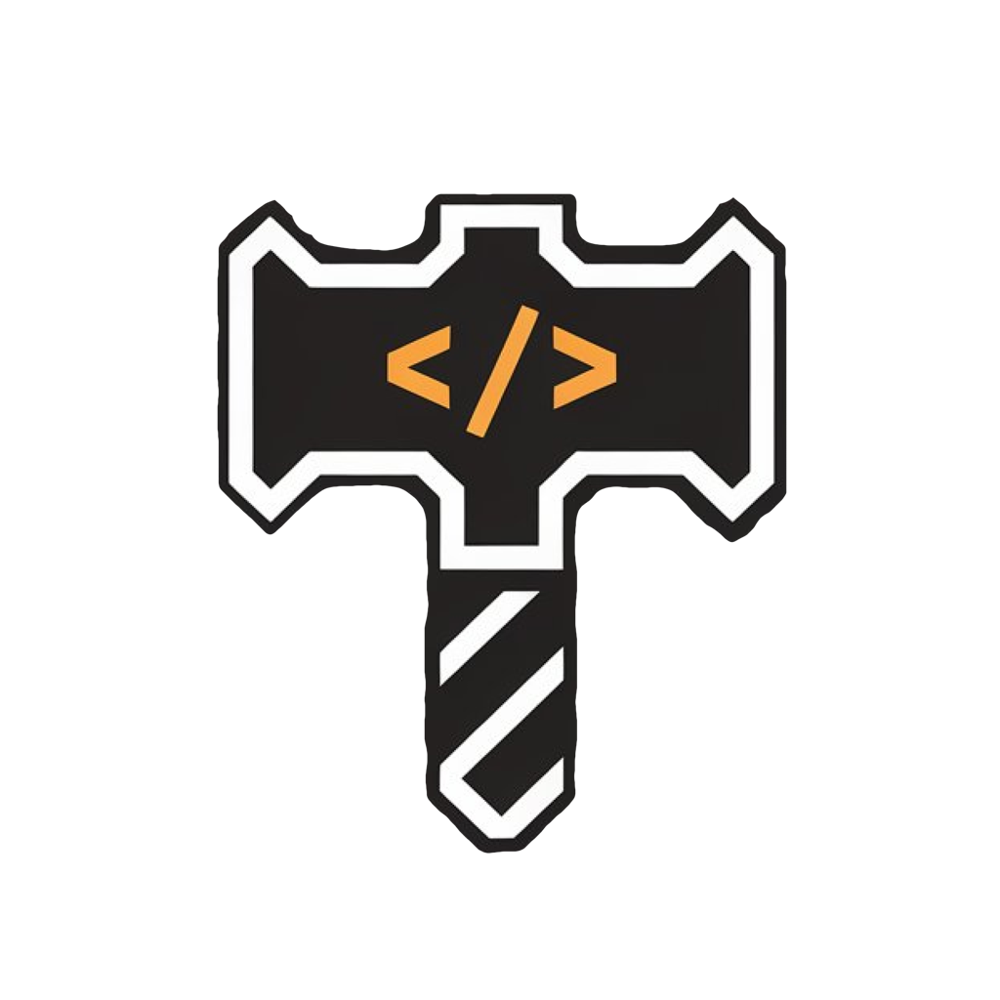

<h1 align="center">DevForge</h1>
<h3 align="center">A powerful toolkit designed for developers, providing a collection of essential utilities to streamline your daily workflow. <a href="./readme_zh.md">[中文]</a> 

## 🚀 Installation

**System Requirements**: macOS 14.0 or later

## 🌍 Community

Your feedback and contributions help make DevForge better.

- **Contribute**: Open issues or pull requests to suggest improvements.
- **Sponsor**: Download the app and explore sponsorship options available within.

## 🙏 Acknowledgements

This project is inspired by [DevToysMac](https://github.com/DevToys-app/DevToysMac), an open-source project that has since been archived.  
_DevForge_ is a reimagined version written in modern **SwiftUI** for macOS, aiming to bring similar utilities with a native Apple experience and continuous updates.

## 📄 License

This project is licensed under the [GNU GPLv3 License](./LICENSE).

**Note:** The official App Store release of _DevForge_ is maintained by the original author.  
While forks are permitted under the GPLv3, please respect the project by not publishing direct copies on the App Store.
