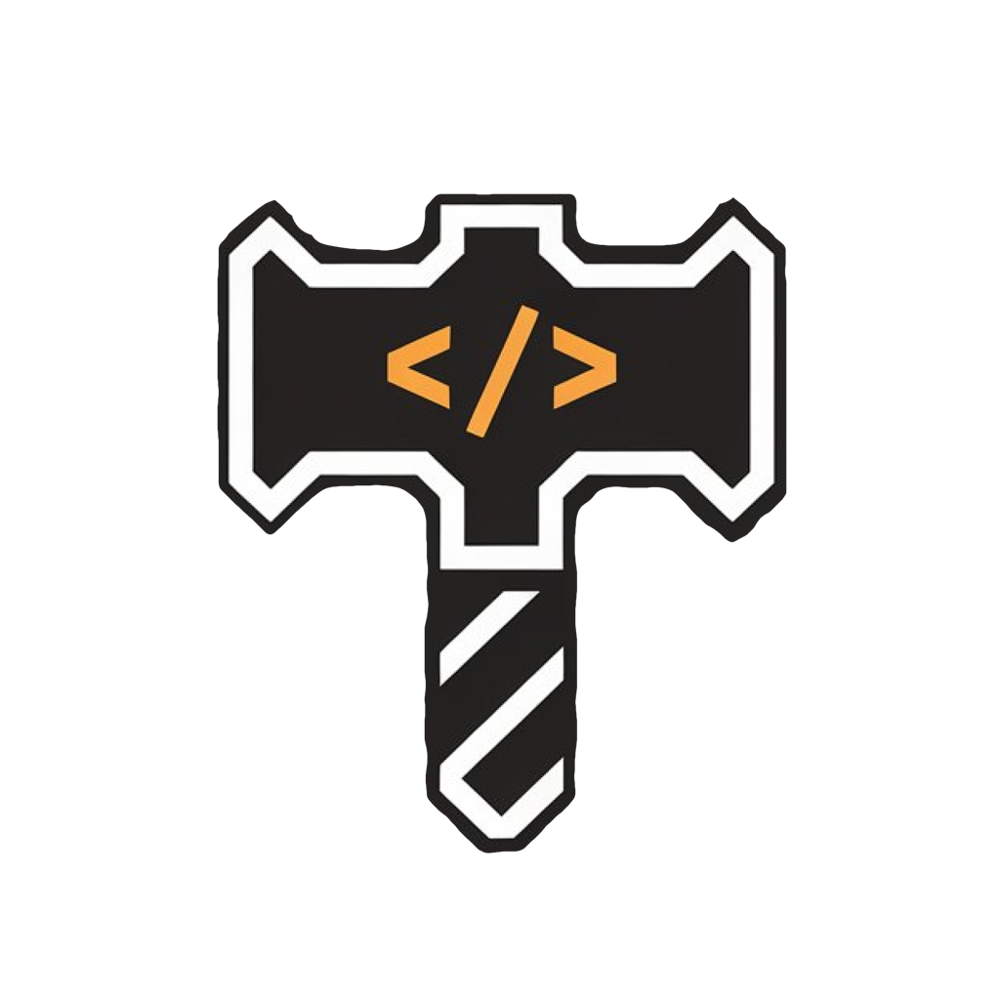

  

<h1 align="center">DevForge</h1>

<h3 align="center">
  一款为开发者打造的强大工具集，提供一系列实用功能，帮助你简化日常开发工作流程。  
     
  <a href="./readme.md">English</a>
</h3>

## 🚀 安装

- **系统要求**：macOS 14.0 或更高版本

## 🌍 社区

你的反馈和贡献能让 DevForge 变得更好。

- **贡献代码**：欢迎提交 issue 或 pull request 来提出改进建议
- **赞助支持**：下载应用后，可以在应用内选择赞助方式支持开发

## 🙏 致谢

本项目受 [DevToysMac](https://github.com/DevToys-app/DevToysMac) 启发，该开源项目现已归档。  
DevForge 使用现代 **SwiftUI** 为 macOS 重新构建，旨在提供类似的开发工具，并带来原生的 Apple 使用体验与持续更新。

## 📄 许可证

本项目基于 [GNU GPLv3 许可证](./LICENSE) 开源。

**说明**：_DevForge_ 在 App Store 上的官方发布版本由原作者维护。  
虽然根据 GPLv3 允许 fork，但请尊重项目，不要将完全相同的副本发布到 App Store。
